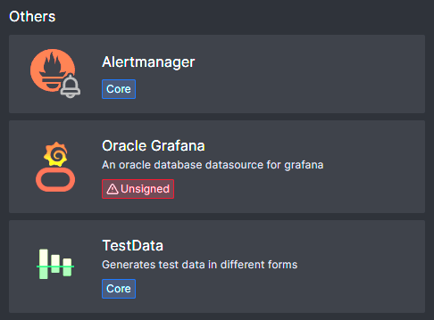
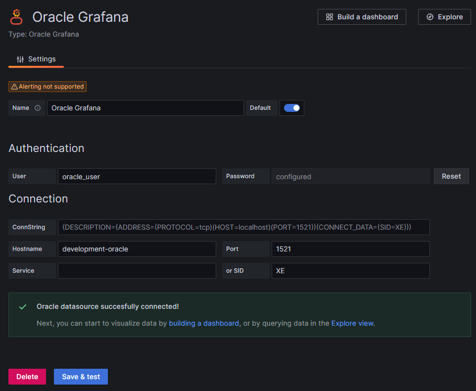
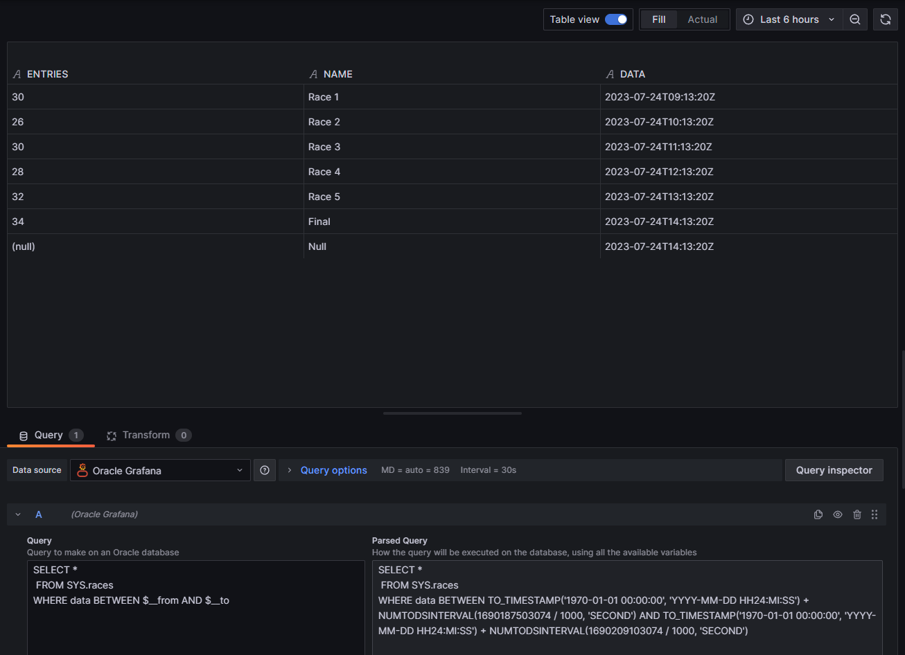
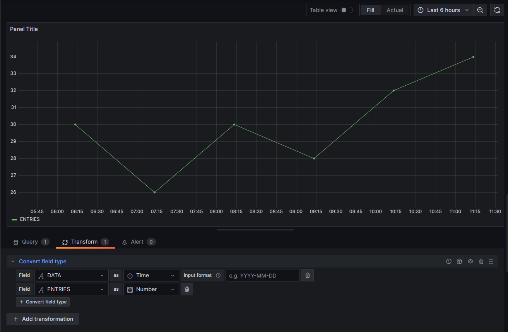
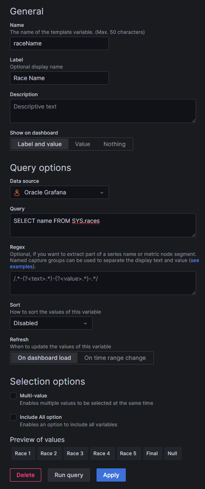
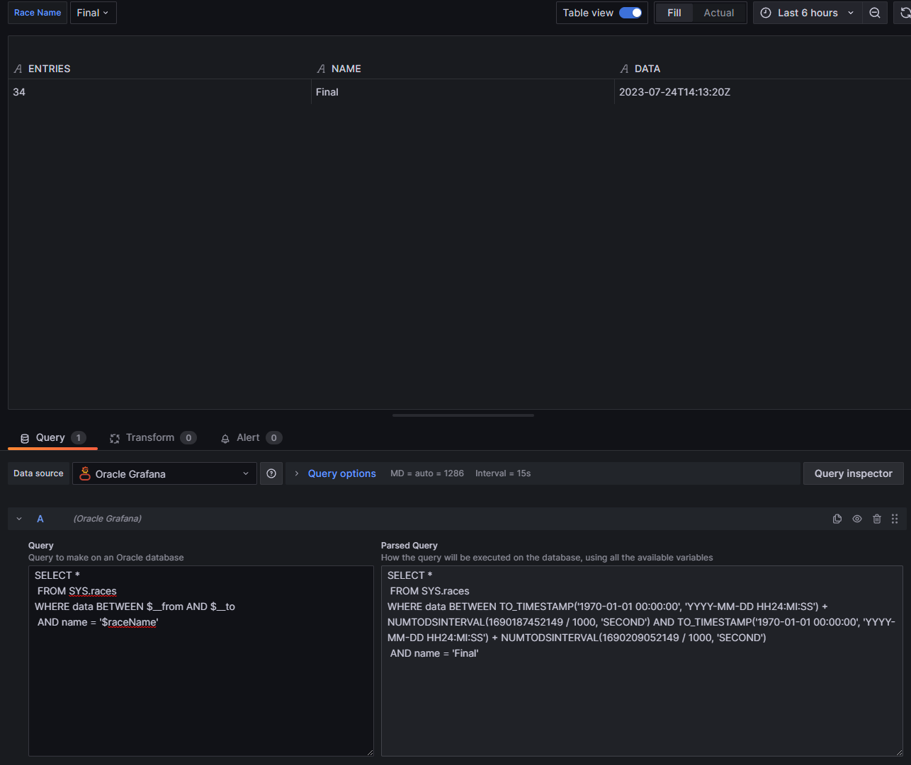

# Oracle Grafana data source plugin

Plugin for translating Oracle queries (SELECT) to grafana dashboards.

It has support for Quey variables and simple variables on SQL preview.

Variable with multiple values will be supported in the future.

## Requirements
* Grafana 9.5+
* Oracle 12+

## Plugin Installation
Grafana servers can load plugins usualy from the /var/lib/grafana/plugins folder, so extract the albertowd-oraclegrafana-datasource-bundle-1.0.0.tar.gz to this folder.

From there, the plugin can be found, but will not be automatically installed without the `GF_PLUGINS_ALLOW_LOADING_UNSIGNED_PLUGINS=albertowd-oraclegrafana-datasource` environment variable or `allow_loading_unsigned_plugins=albertowd-oraclegrafana-datasource` in tue grafana.ini file defining the plugin id.

Restart the grafana server and then the new data source must be visible at the Data source creation list:

## Configuration

The configuration can be configured using the simple fields or using the `ConnString` field ignoring the others.

## Queries
The plugin only support the SELECT query.

But it has a preview feature on the query configuration page so the user can view how it will run after replace all the Grafana variables within.

It can use any simple variable created on the Grafana instance, just prefix the variable name with `$` on the query editor.

It includes the default ones too: `$__from` and `$__to` from the dashboard:

## Timeseries
The plugin can only see string variables, for now, so, the fields must be converted before using in `timeseries` charts:

## Query Variables
Also, it can be configured variables using the data source as well, with custom SQL that returns only one column:

And then using it on the query editor and dashboards using the dropdown variable:

